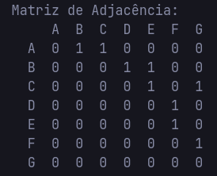
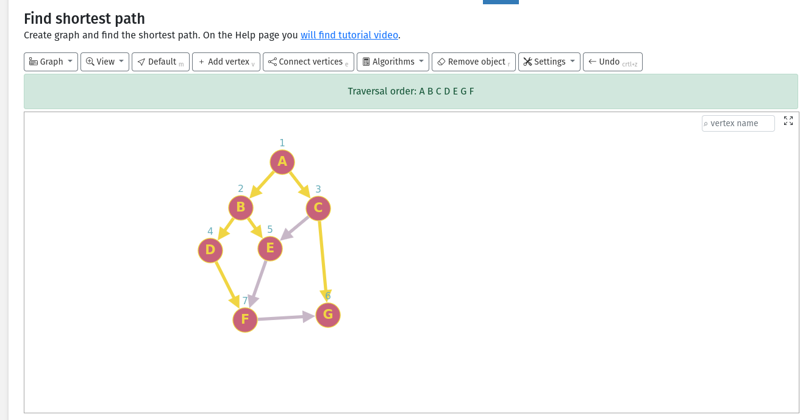
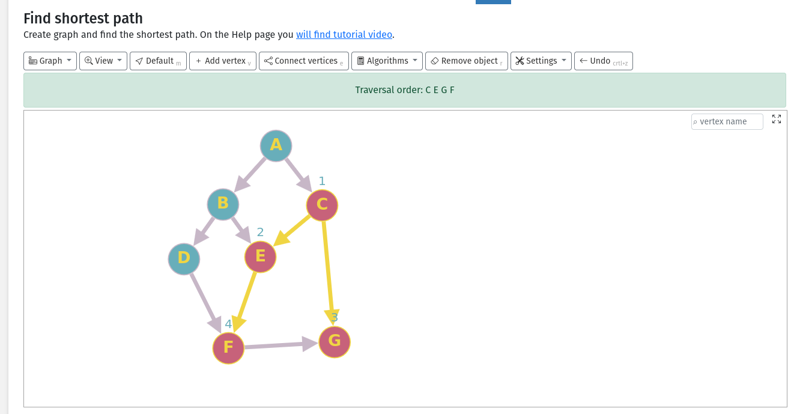
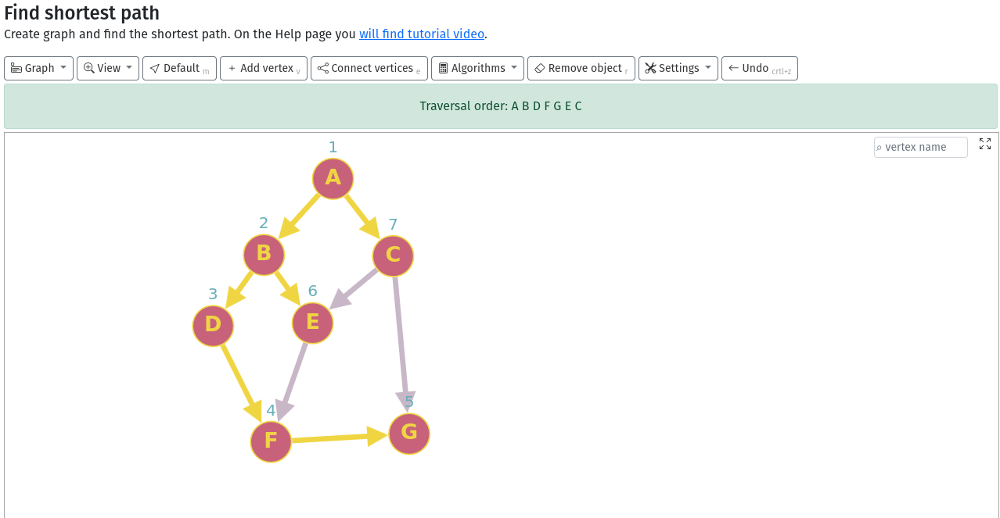
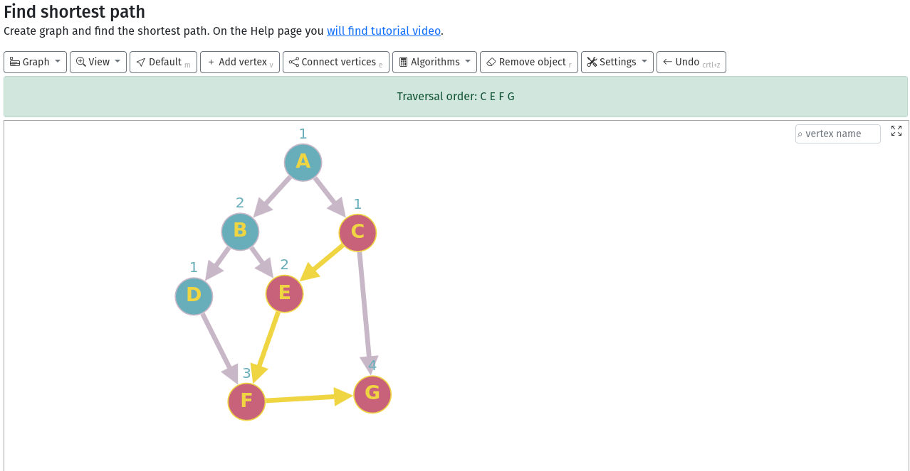

# Trabalho M1 – Grafos Lista e Matriz

## Alunos: Rafael Mota Alves e Nilson Andrade Neto

## Descrição
- Objetivo: implementar um grafo e as funções básicas de seu funcionamento nas duas representações pedidas: por lista de adjacência e por matriz de adjacência.
- Escopo: as funções listadas nos slides S02 – Conceitos Básicos e Representação devem existir em AMBAS as representações.

No código atual há uma interface comum (`src/include/Grafos.h`) e duas implementações:
- `GrafoMatriz` (`src/include/GrafoMatriz.h`): estrutura de matriz de adjacência, já com inserção de vértices/arestas e impressão básica da matriz.
- `GrafoLista` (`src/include/GrafoLista.h`): estrutura por lista de adjacência (a serem implementados).

O leitor de arquivo (`src/include/LeitorGrafo.h`) carrega o grafo a partir de um arquivo de texto e informa se o grafo é direcionado e/ou ponderado.

## Como Rodar
Pré‑requisitos: `g++` instalado. O `Makefile` linka `-lGL -lglut` (não utilizados no momento); se não tiver essas libs, remova-as do `Makefile` ou instale as dependências.

1) Compilar:
- `make`

2) Executar:
- `./main caminho-do-arquivo.txt`
- Se não informar um caminho, usa `filename.txt` por padrão.

Arquivos de exemplo:
- `filename.txt` (3 vértices)
- `filename7.txt` (7 vértices)

## Formato do Arquivo de Entrada
Primeira linha: `V A D P`
- `V`: número de vértices
- `A`: número de arestas
- `D`: 1 se direcionado, 0 caso contrário
- `P`: 1 se ponderado, 0 caso contrário

Demais linhas: uma aresta por linha
- Não ponderado: `origem destino`
- Ponderado: `origem destino peso`

Exemplo (`filename.txt`):
```
3 4 0 1
0 1 5
0 2 2
1 2 7
2 0 1
```

---
# Testes BFS e DFS:

### Valores para teste 

```txt
7 9 1 0
0 1
0 2
1 3
1 4
2 4
3 5
4 5
5 6
2 6
```


## Grafo Matriz BFS TEST: 

### Teste realizado no [Graph Online](https://graphonline.top/)

#### Começando no vertice 0 ou A

> Nosso resultado: A B C D E G F ✅

### Começando no vertice 2 ou C

> Nosso resultado: C E G F ✅

## Grafo Matriz DFS TEST: 

### Teste realizado no [Graph Online](https://graphonline.top/)

#### Começando no vertice 0 ou A

> Nosso resultado: A B D F G E C ✅

### Começando no vertice 2 ou C

> Nosso resultado: C E F G ✅
